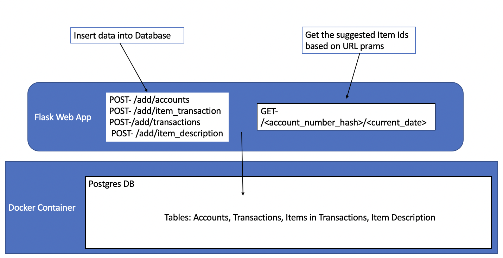

# NCR Machine-Learning Application
### Goal
To maximize profits for an e-commerce company, by provided purchasing suggestions to users.

### Solution
Easy-to-use Machine-Learning (ML) applications that gives Data Driven suggestions to users by analyzing there 
average purchase cycles for previously bought products. A simple "Buy-it-again" design.

### Reasoning
People make decisions by minimizing costs. While cost are mostly thought of as monetary, behavioral
economic research shows that effort is a driving force in decision-making. People prefer to take the 'path of least
resistance'.
This application is design to oblige to the user's low effort preference. 

Example: A person buys paper towels every week. My model picks up on this trend, and can be formatted
to remind the user that she needs more towels after one week.

### Architecture
Below is the general architecture of the wsb-scrapper.


### ML Model
located at ncr_project/src/app/services/model_BasedOnPastPurchases.py. <br>
The model takes in two parameters, account_number_hash and current_date.
Gets transactions and items in those transactions based of an account_number_id. Then for each unique item
it finds the average days between the reoccurring purchases, called avy_cycle. If the distance between the current date
and the last-date-of purchase is equal to to greater than the average_cycle, then it returns 
that item ID.
The returned item ids are the application's suggestions.

## Start Up
for mac/linux users, clone repo then run 
```bash
sh build.sh
```

### Future Ideas
The given data was on for a month, I believe this application has far greater value
when there is more time periods. One reason for this is it will increase degrees-of-freedom (*df*).
With more *df*s we can start running regressions to predict the next cycle, instead of just
calculating average_cycle. An example model would be average_cycle on quantity of good purchased(t-1)
and month of year.

Due to the time constraint, the algo is not at optimal speed. I want to decrease runtime. This
is especially important if more data is given.

Also, I want to explore unsupervised/supervised learning to find better categories for each item.
The categories given, had certain issues. Once I have better categories, I can start to develop
a Neural Network to suggest new items. I have experience in PyTorch and wanted to use it, but that is
a very time-consuming method.